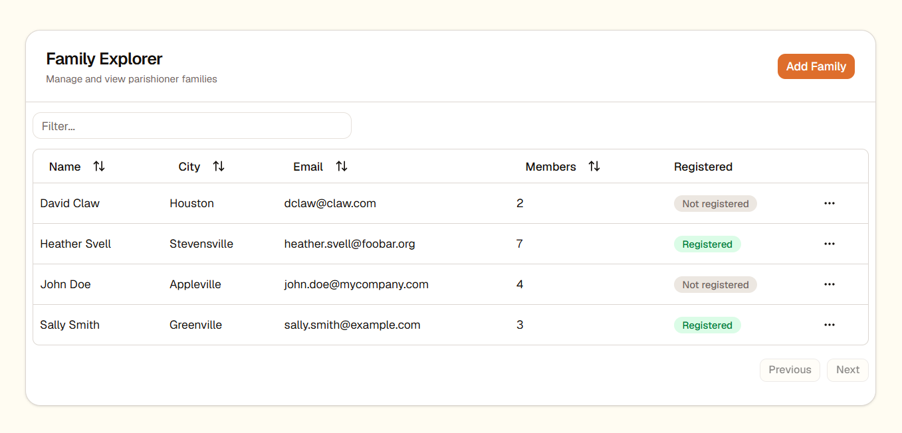
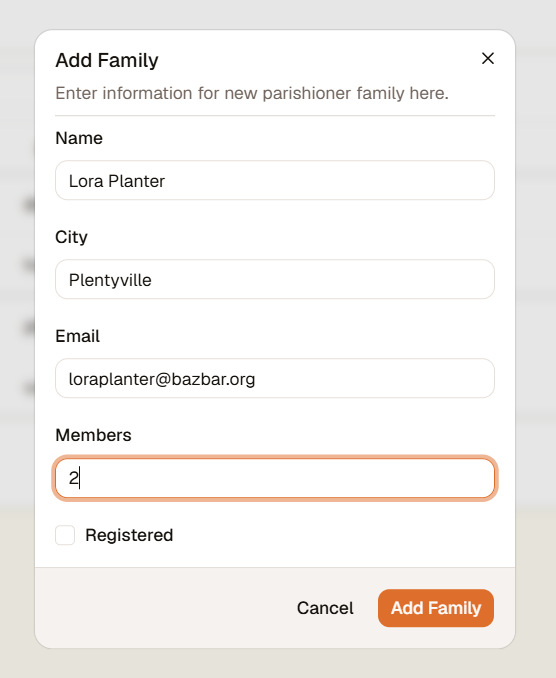
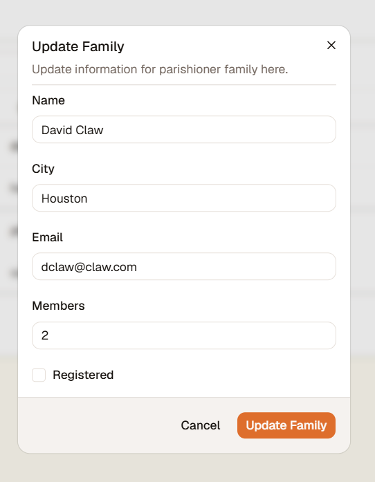
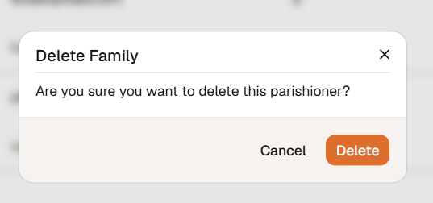
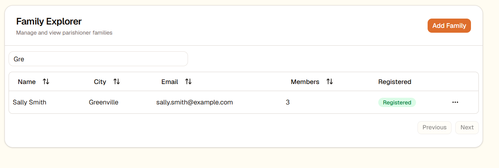

## Overview

Welcome to Atlus! Atlus is a simple church parishioner management application. Users can create, edit, delete, view, filter, and sort through families in their church.

Atlus is built with a Golang Gin API backend, supported by MySQL, and a React Tailwind frontend.

## Getting Started

To get started, ensure you have both [Docker](https://docs.docker.com/engine/install/) and [Docker Compose](https://docs.docker.com/compose/install/) installed, then run the following command:

```bash
docker compose up --build
```

This will spin up three containers:
- `atlus_db` --> MySQL database storing parishioner data
- `atlus_api` --> Backend Golang API
- `atlus_frontend` --> React web application

You can access the app running at `http://localhost:80`.

### Viewing Parishioners
You can view all parishioners from the main landing page of the application:


*Figure 1: Viewing all stored parishioners*

### Adding New Parishioner
To add a new parishioner to the application, select the `Add Family` button on the top right, and enter their details into the provided prompt:


*Figure 2: Adding a new parishioner family*


### Updating Parishioner Information
To update parishioner details, select the three dots action menu for their respective table row, select `Edit Details`, and update their details in the provided prompt:


*Figure 3: Updating parishioner details*


### Deleting Parishioner
To remove a parishioner from the application, select the three dots action menu for their respective table row, select `Delete`, then confirm in the provided modal:


*Figure 4: Deleting a parishioner*


### Searching for Parishioner
To filter for a given parishioner or parishioners, you can filter via the provided search box by name, email, city, or number members:


*Figure 5: Filtering for a parishioner*